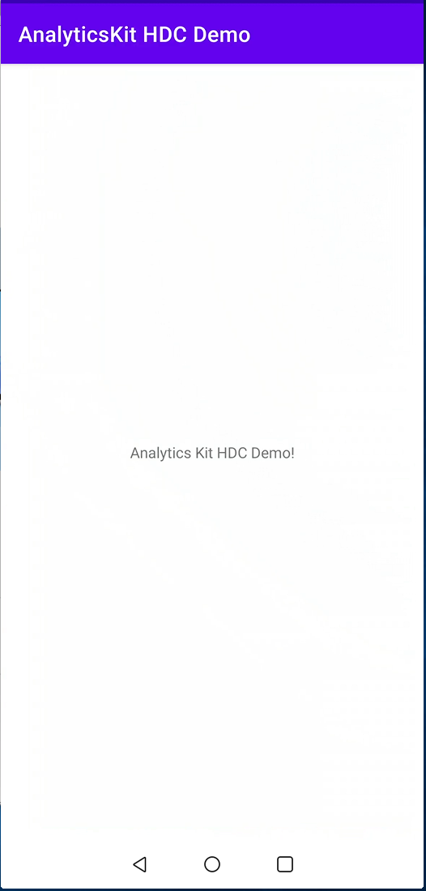
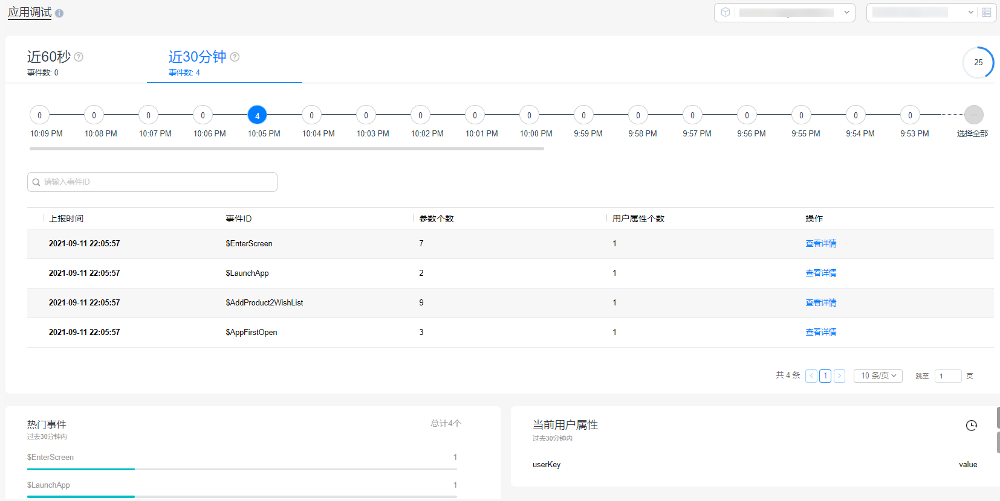

# Analytics Kit Demo for Android

## Contents

* [Introduction](#Introduction)
* [Getting Started](#Getting-Started)
* [Installation](#Installation)
* [Configuration](#Configuration)
* [Environment Requirements](#Environment-Requirements)
* [Operation Result](#Operation-Result)
* [License](#License)

## Introduction
The Analytics Kit HDC demo provides the sample code for integrating Analytics Kit into apps. It illustrates how to use the main APIs of Analytics Kit, for example, the API for recording custom events or setting user attributes.
[Learn more about Analytics Kit](https://developer.huawei.com/consumer/en/doc/development/HMSCore-Guides/introduction-0000001050745149).

## Getting Started

For details, please refer to the links below:

[Development Guide](https://developer.huawei.com/consumer/en/doc/development/HMSCore-Guides/android-dev-process-0000001050163813)

[API Reference](https://developer.huawei.com/consumer/en/doc/development/HMSCore-References/android-api-analytics-overview-0000001051067140)

The Analytics Kit HDC demo is used as an example to describe how to use the Analytics SDK for Android by using the Gradle build system.

First, download the Analytics Kit HDC demo by cloning this repository or downloading the compressed package.

In Android Studio, click **Open an existing Android Studio project** and select **AnalyticsKitHDCDemo**.

You can use the **gradlew build** command to build the project.

Create an app in AppGallery Connect, obtain the **agconnect-services.json** file, and add the file to your project. Click [here](https://developer.huawei.com/consumer/en/doc/development/HMSCore-Guides/android-dev-process-0000001050163813) to learn more.

## Installation
Use Android Studio to open the decompressed project.

## Configuration
1. Create an app in AppGallery Connect and obtain the configuration file **agconnect-services.json**. In Android Studio, switch to the **Project** view and move the **agconnect-services.json** file to the app-level directory.
2. Change **applicationId** in the app-level **build.gradle** file to the app package name obtained in the first step.

## Environment Requirements
Hardware:
1. A computer (desktop or laptop)
2. A Huawei phone used for app debugging
  
Software:
1. Analytics Kit 6.2.0
2. Android API level 18 (Android 4.3 Jelly Bean) or later
3. Android Studio 3.6.1 or later
4. Android Gradle plugin 3.5.4 or later
5. JDK 1.8 or later

## Operation Result
**Enable the debug mode**. After running the app, you will see the following screen.

After the data is successfully reported, you can go to **HUAWEI Analytics** > **App debugging** to view the reported data.

## License
The Analytics Kit HDC demo is licensed under [Apache 2.0](http://www.apache.org/licenses/LICENSE-2.0).
